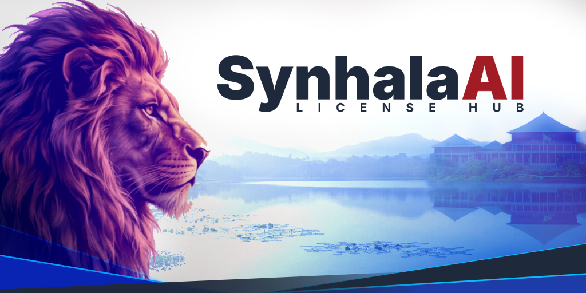
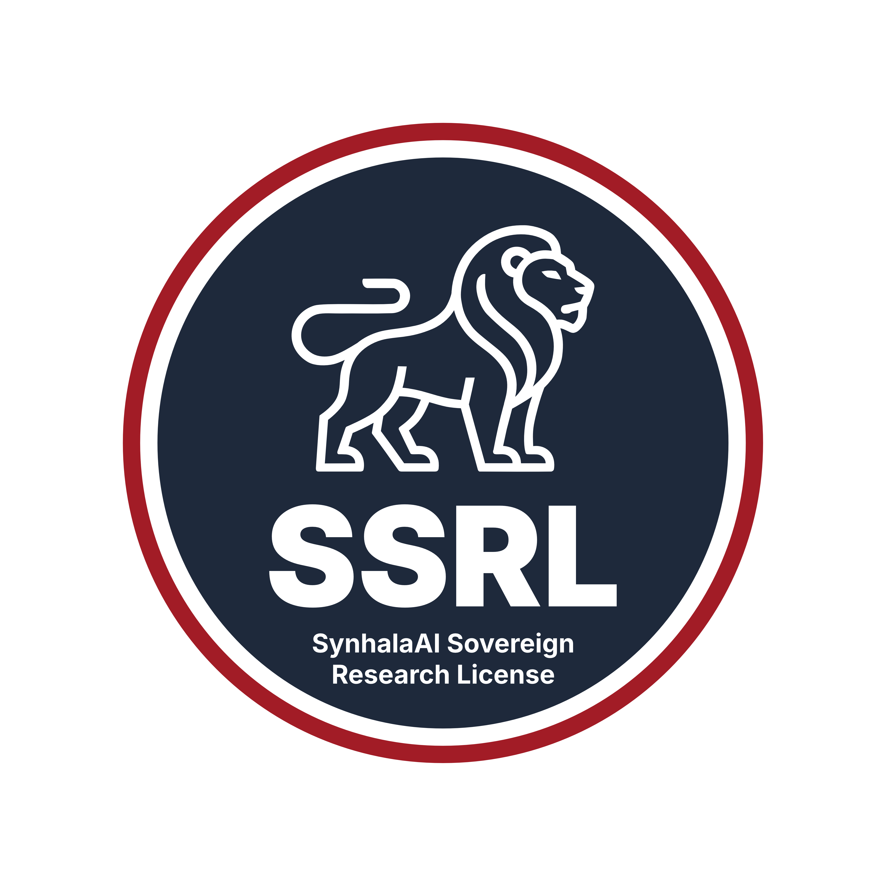

  

<h1 align="center">SynhalaAI License Hub</h1>

  <strong>Sinhala. Intelligence. Future.</strong> 
  <em>A Sovereign Public Trust Framework Dedicated Exclusively to the People of Sri Lanka.</em>

  

---

## About This Repository

**The central licensing hub and legal repository for the SynhalaAI ecosystem** — data governance terms, benchmark policies, and model licenses, administered by **SynhalaAI** and powered by **skAI — SKY PRODUCTION**.

The first license published here is the **SynhalaAI Sovereign Research License (SSRL)**, Version 1.0 (2026) — an independent, sovereign public license that governs the use, study, adaptation, and distribution of datasets, linguistic corpora, benchmarks (including SynhalEES), neural models, software, code, checkpoints, and associated documentation (collectively, the "Licensed Materials").

The full license text is available here: **[SSRL.md](SSRL.md)**

> More SynhalaAI licenses and policy documents are **coming soon**.

## License Summary

The following is a brief, non-binding overview - the legally binding text is in [SSRL.md](SSRL.md).

- **Exclusive to Sri Lanka** - All rights under the SSRL are strictly limited to Eligible Sri Lankan Licensees: verified citizens of Sri Lanka, or academic, educational, and non-profit research institutions incorporated, registered, and physically situated within Sri Lanka. Foreign access and proxy use are prohibited.
- **Public Welfare Research** - Eligible Licensees may access, execute, reproduce, study, and modify the Licensed Materials, and build Derivative Works, solely for non-commercial Public Welfare Research within Sri Lanka.
- **Public Trust Ownership** - Derivative Works cannot be privately monopolized: by creating a Derivative Work you assign all rights in the improvements to the Licensor (SKY PRODUCTION / SynhalaAI) to be held in perpetual public trust, and any shared Derivative Work must carry the identical SSRL v1.0. Patents and restrictive IP claims on the materials or their improvements are prohibited.
- **Zero Commercial Use** - Neither the Licensed Materials nor any Derivative Works or outputs may ever be used commercially, by any party, including the Licensor. No paid exceptions, tiers, or waivers exist.
- **Ethical Guardrails** - The materials may never be used to denigrate the Sinhala language or Sri Lankan cultural heritage, promote hatred or violence, enable non-consensual deepfakes or illegal surveillance, or violate Sri Lankan law.
- **Breach = Automatic Termination** - Any commercialization, foreign access facilitation, or privatization of improvements immediately revokes all rights and triggers a duty to purge all copies.
- **Governing Law** - The license is governed by the laws of the Democratic Socialist Republic of Sri Lanka, with exclusive jurisdiction in the courts of Colombo.

## Repository Contents

| File | Description |
|------|-------------|
| [SSRL.md](SSRL.md) | The full SynhalaAI Sovereign Research License v1.0 text |
| [assets/](assets/) | Cover artwork and branding assets |

## License

All materials in this repository are distributed under the **SynhalaAI Sovereign Research License v1.0 (SSRL-1.0)**. See [SSRL.md](SSRL.md) for the complete terms.

---

**SynhalaAI Sovereign Research License — Version 1.0 (SSRL-1.0) — 2026**
*Administered by SynhalaAI · Powered by skAI — SKY PRODUCTION*

